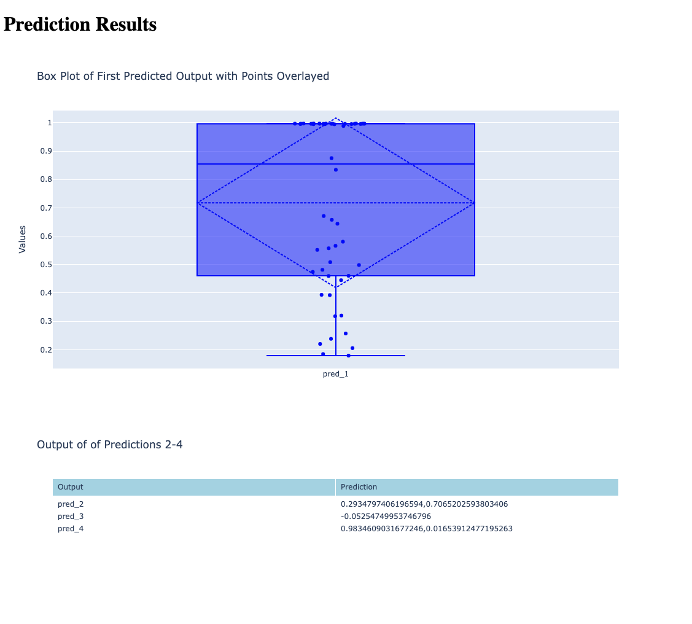

# ecg2af-web-app

# Getting Started
* [Setup on MacOS](##setup-on-macos)
* [Application Usage](##application-usage)
* [Scalability Question](##scalability-question)
* [Use of external resources](##use-of-external-resources)

## Setup on MacOS

***Note: I highly recommend <u>not</u> using an M2 chip Mac machine when trying to use the ml4h image***. There are many issues that arise with how TensorFlow gets built. Resolving how it gets built often causes incompatibility issues between Python version, `tensorflow`, and `tensorflow-<xxx>` libraries.

### Initial setup steps:
```
git clone https://github.com/NickDiNapoli/ecg2af-web-app.git
```
```
git clone https://github.com/broadinstitute/ml4h.git
```
If needed, complete the following two steps:
```
brew install git-lfs
```
```
git lfs install
```
```
cd ml4h
```
```
git lfs pull --include "model_zoo/ECG2AF/ecg_5000_survival_curve_af_quadruple_task_mgh_v2021_05_21.h5"
```

### If using existing Docker image (I used for application):
```
cd ecg2af-web-app
```
```
docker pull ghcr.io/broadinstitute/ml4h:tf2.9-latest-cpu
```
Change the model path to wherever you have it stored locally which is likely: ml4h/model_zoo/ECG2AF/ecg_5000_survival_curve_af_quadruple_task_mgh_v2021_05_21.h5
```
docker run -it --rm -p 5001:5001 -v $(pwd):/app -v /Users/nickdinapoli/Downloads/ecg_5000_survival_curve_af_quadruple_task_mgh_v2021_05_21.h5:/app/src/ecg2af_web_app/models/ecg_5000_survival_curve_af_quadruple_task_mgh_v2021_05_21.h5 ghcr.io/broadinstitute/ml4h:tf2.9-latest-cpu /bin/bash
```
```
pip install .
```
```
pip install -r requirements.txt
```
```
cd src/ecg2af_web_app/
```
```
python app.py
```

### If using Poetry (I used for running local ipynb):
```
pip install poetry
```
```
poetry lock
```
If `poetry lock` fails with ml4h included in the dependencies, comment out the dependency.
```
poetry install
```
```
poetry shell
```
If ml4h still needs to be installed complete one the following two steps: 
```
pip install -r requirements.txt
``` 
OR:
```
cd ml4h
``` 
and then
```
pip install .
```
Select `.venv` for kernel.

### Alternative approaches

### If building Docker image:
Clone ecg2af_web_app repository
```
cd ecg2af-web-app
```
```
docker build -t ecg2af-web-app .
```
```
docker run -it ecg2af-web-app
```
Again change the model path to wherever you have it stored locally. 
```
docker run -it --rm -p 5001:5001 -v $(pwd):/app -v /Users/nickdinapoli/Downloads/ecg_5000_survival_curve_af_quadruple_task_mgh_v2021_05_21.h5:/app/src/ecg2af_web_app/models/ecg_5000_survival_curve_af_quadruple_task_mgh_v2021_05_21.h5 ghcr.io/broadinstitute/ml4h:tf2.9-latest-cpu /bin/bash
```
```
cd src/ecg2af_web_app/
```
```
python app.py
```

### If using pip + virtual env
- Clone ecg2af_web_app repository
- Clone ml4h repository
- Ensure you are using Python 3.8.10 (same as ml4h image)
```
python3 -m venv venv
```
```
source venv/bin/activate
```
Install ml4h project:
```
pip install -r requirements.txt
``` 
OR: 
```
cd ml4h
```
and then 
```
pip install .
```

## Application Usage

For this project I chose to use to use Flask as the web framework for a few reasons. I do not have a ton of prior experience with web applications so I went with Flask because of its simplicity and because I had used it once or twice in my Master's coursework. 

Once you have ran `python app.py`, the first HTTP address will navigate you to a simple welcome page seen below:


Click the "Choose File" button and upload the sample ECG data (`fake_0.hd5`) from wherever it is stored locally. Click the "Predict" button to run inference on the data. The page will update automatically with the prediction results as seen below. 



The figures are both interactive for an enhanced user experience. The user can hover over the boxplot and immediately receive some key statistics about the results as seen here:


Using the back button in your browser will allow the welcome page to reload if you wish to run inference using another ECG file. 


## Scalability Question

*Explain how you would scale the solution to allow analysis of a larger volume of data (e.g., 10,000 ECGs) and accommodate more users.*

My first impression is to use cloud resources/tools. If the application is deployed on a cloud platform, the scaling of microservices and batch processing might be greatly simplified. For me in my experience with AWS ECR + Batch, I would re-write the application to accept many datasets and distrubute jobs amongst all available proceeses. I would also decouple the data pre processing and model inference steps into different modules/services which could provide additional speed up. Additional ideas that I have implemented in the past is model caching which allows for lower latency and efficient handling of jobs/requests. Lastly, I could also re-write the model inference to take further advantage of GPUs and batch processing. After my first impression comes a bit of research, and based on this research, I see that two more ideas for handling larger volumes of data are async processing as well as database optimization. If a proper database is set up to store datsets, predictions, and metadata, a more sound database might allow for quicker read/write of this data. 

## Use of external resources

I used ChatGPT to help build the HTML files as well as route the interactive plots through these pages as I have a little less experience with front-end. I also leveraged it to assist with setting up the proper Flask decorators. 